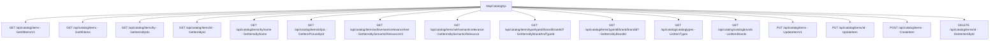

# CatalogApi Endpunkt-Übersicht (Mermaid)

```mermaid
graph TD
    A[MapCatalogApi] --> B1[GET /api/catalog/items - GetAllItemsV1]
    A --> B2[GET /api/catalog/items - GetAllItems]
    A --> B3[GET /api/catalog/items/by - GetItemsByIds]
    A --> B4[GET /api/catalog/items/id - GetItemById]
    A --> B5[GET /api/catalog/items/by/name - GetItemsByName]
    A --> B6[GET /api/catalog/items/id/pic - GetItemPictureById]
    A --> B7[GET /api/catalog/items/withsemanticrelevance/text - GetItemsBySemanticRelevanceV1]
    A --> B8[GET /api/catalog/items/withsemanticrelevance - GetItemsBySemanticRelevance]
    A --> B9[GET /api/catalog/items/type/typeId/brand/brandId? - GetItemsByBrandAndTypeId]
    A --> B10[GET /api/catalog/items/type/all/brand/brandId? - GetItemsByBrandId]
    A --> B11[GET /api/catalog/catalogtypes - ListItemTypes]
    A --> B12[GET /api/catalog/catalogbrands - ListItemBrands]
    A --> B13[PUT /api/catalog/items - UpdateItemV1]
    A --> B14[PUT /api/catalog/items/id - UpdateItem]
    A --> B15[POST /api/catalog/items - CreateItem]
    A --> B16[DELETE /api/catalog/items/id - DeleteItemById]
```

> Dieses Diagramm visualisiert die wichtigsten API-Endpunkte und deren zugehörige Methoden der Klasse `CatalogApi`.
